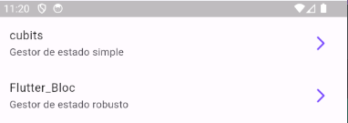

Documentación avanzada de flutter: 

# BLoC (Bussines logic component) - flutter_Bloc y Cubits

Técnicamente es uno solo, pero tiene esas dos ramificaciones. Normalmente flutter_Bloc es más usado pero se suele usar los cubits cuando queremos tener un estado más pequeño y queremos mantenerlo más simple. 

La idea de usar este provider es separar la data, el state de los widgets y cuando un widget necesite información de algún formulario que vaya y la tome y haga lo que tenga que hacer.

Hay muchas similitudes con Provider, uno va al blog y disparar eventos y demás. 


## Objetivo de la sección

Aprender lo siguiente: 

1. BLoC
2. Flutter Bloc
3. Cubits
4. Equatable
5. Eventos
6. Estado

### Iniciando el proyecto:

Como siempre ctrl+shift+p, nuevo proyecto, seleccionamos el lugar de arribo de los archivos. Agregamos el dispositivo con el que vamos a trabajar e inicializamos el proyecto con F5. Happy coding!

Mucha gente le corre a flutter Bloc que es la implementación de Bloc en flutter porque tiene como mucho código intermedio para hacer algo funcional se necesitan varios pasos. En cambio los cubits es mucho más sencilla.

Link a documentación oficial de BLoC: https://pub.dev/packages/flutter_bloc. Tiene muchas referencias a provider y tiene sus similitudes con riverpod.

Recordando que es importante siempre quitar la opción de debugg en nuestro main
```dart 
 return const MaterialApp(
      debugShowCheckedModeBanner: false,
      ...  
    );
```

## Estructura Inicial del proyecto:


### Estructura de carpetas: 

* Inicialmente creamos los directorios: config > router & theme > app_theme.dart

* Creamos el directorio presentation > screens > home_screen.dart 

* Siempre que manejamos gestores de estado los manejamos dentro de la capa de presentación y se le asigna el nombre del gesto de estado que vamos a utilizar, por lo que en este caso que es bloc quedaría así: presentation > blocs > clickizq + Cubit:new Cubit


*Tener instalada la extención oficial de bloc es importante porque da pie a la creación de la configuración inicial rápida*


### Configuración del app_theme

* En el app_theme estamos realizando la configuración de todos los estilos de la aplicación, entonces inicialmente tenemos esta configuración: 

```dart
import 'package:flutter/material.dart';

class AppTheme {
  ThemeData getTheme(){
    const seedColor = Colors.deepPurpleAccent;

    return ThemeData(
      useMaterial3: true,
      colorSchemeSeed: seedColor,
      listTileTheme: const ListTileThemeData(
        iconColor: seedColor
      )
    );
  }
}
```

Que es una clase que indica que va a utilizar el widget de material ThemeData, usando material 3, que el la paleta de colores inicial va a ser la que definimos y que las listas van a tener unos colores diferentes. Estas configuraciones son muy generales pero a la larga muy personalizables e importantes en el aplicativo.

Seguido de esto es importante que tengamos en cuenta poner esta aplicación en nuestro main, por lo que justo debajo de nuestro debugBanner vamos a instanciar la clase y llamar el método getTheme(), importante tener en cuenta que ya no va a ser una constante por lo que hay que quitarla de forma global: 

```dart 
 return MaterialApp(
      debugShowCheckedModeBanner: false,
      theme: AppTheme().getTheme(),
      ...
    );
```

### Configuración de la home_screen

En esta vista se encuentra todo lo que el usuario ve apenas ingresa a la aplicación. Inicialmente en el modelo de la aplicación se quiere que lo primero que vea el usuario sea una interfaz sencilla con una especie de botones largos de navegación para poder dirigirse a diferentes partes de la aplicación. 

La configuración general se encuentra en el archivo home_screen.dart, pero la configuración de estos botones con ícono es la siguiente: 

```dart
 ListTile(
    title: const Text('cubits'),
    subtitle: const Text('Gestor de estado simple'),
    trailing: const Icon(Icons.arrow_forward_ios_rounded),
    onTap: () => {},
),
```
---------


-----------
Luego de la creación de este archivo es una buena práctica crear un archivo de exportaciones para evitar tener muchas imports en algunas partes de código. Lo único que se hace es exportar todo lo que contiene este archivo.

### Configuración de las rutas:

Dentro de la carpeta de router vamos a crear el app_router.dart, y además vamos a instalar la dependencia de go_router:

```bash
flutter pub add go_router
```

Ahora dentro del archivo de app_router vamos a crear la configuración de enrutamiento:

```dart
import 'package:forms_app/presentation/screens/screens.dart';
import 'package:go_router/go_router.dart';

final appRouter = GoRouter(
  routes: [
    GoRoute(
      path: "/",
      builder: (context, state) => const HomeScreen(),
    ),
  ]
);
```
-------
De esta forma le estamos diciendo a la aplicación que utilice HomeScreen() como ruta por defecto. En mi main.dart vamos a poner lo siguiente:

```dart
class MainApp extends StatelessWidget {
  const MainApp({super.key});

  @override
  Widget build(BuildContext context) {
    return MaterialApp.router(
      routerConfig: appRouter,
      debugShowCheckedModeBanner: false,
      theme: AppTheme().getTheme()
    );
  }
}
```

Como se puede observar con el .router en el widget de MaterialApp le indicamos a flutter que vamos a usar un enrutador y en el routerConfig vamos a poner nuestro appRouter, que toma la configuración que creamos anteriormente en nuestro app_router.dart 


### Procedimiento para la creación y enrutamiento de otro screen

En el caso de crear otro screen simplemente hay que configurarlo como mejor se considere necesario. Luego se exporta en el archivo de screen de bareer y se utiliza en el router como una nueva ruta: 

```dart
GoRoute(
  path: "/cubits",
  builder: (context, state) => const CubitCounterScreen(),
),
```

Luego en mi archivo donde definí el botón donde require la acción al evento del tap genero el siguiente código:

```dart
ListTile(
  ...
  onTap: () => context.push("/cubits"),
),
```

De este modo al darle click a este ListTile va a navegar a la ubicación que definí en mi goRouter.


* Importante: Cuando se crean floatingActionButtons hay que tener cuidado con sus identificadores, ya que si no se les pone un heroTag para saber cual es cual flutter arroja un error:

```dart
floatingActionButton: Column(
  mainAxisAlignment: MainAxisAlignment.end,
  children: [
    FloatingActionButton(
      heroTag: "1",
      child: const Text("+3"),      
      onPressed: () => {},
    ),
    const SizedBox(height: 10),
    FloatingActionButton(
      heroTag: "2",
      child: const Text("+2"),      
      onPressed: () => {},
    ),
    const SizedBox(height: 10),
    FloatingActionButton(
      heroTag: "3",
      child: const Text("+1"),      
      onPressed: () => {},
    ),
  ],
),
```


## Cubit -> Gestor de estado:

Viene incluido con flutter bloc. Por lo que basta con instalarlo para poderle dar uso:

```bash
flutter pub add flutter_bloc
```

Viene con widgets espeçificos para usar BLoC. 

Para la configuración inicial es importante notar que por defecto al usar la extensión los archivos vienen con una serie de configuraciones. Algunas de ellas pueden ser modificadas, como por ejemplo la importación de bloc, es flutter_bloc, o la importación extra que trae no es necesaria.

Vemos que el cubit_state es parte del counter_cubit por lo que es como una extensión del mismo. 

Creando nuestra propia clase definimos los estados que deseamos mantener en nuestro proyecto: 

```dart
class CounterState{
  final int counter;
  final int transactionCount;

  CounterState({
     this.counter = 0, 
     this.transactionCount = 0
  });
}
```

Una vez creamos el estado, debemos crear una forma de emitir dicho estado para poder estarlo cambiando, un nuevo estado va a ser una nueva instancia de el estado actual

```dart
copyWith({
    int? counter,
    int? transactionCount,
  }) => CounterState(
    counter: counter ?? this.counter,
    transactionCount: transactionCount ?? this.transactionCount
  );
```

Usando el copyWith que es un método ya propio de flutter vamos a tener un método para cambiar el constructor y así actualizar mi estado. Es un método muy útil.

Luego en nuestro counter_state vamos a enviar la instancia de counterState() y esto es todo lo que necesitamos. Una estado.

* En el counterCubit podríamos asimilarlo como si fuera un provider, podemos tener métodos, propiedades propios del cubit que no estan amarradas al estado. O recibir información de otro cubit. Entonces podemos hacer algo como esto: 

```dart
class CounterCubit extends Cubit<CounterState> {
  CounterCubit() : super(CounterState( counter: 5));

  void increaseBy (int value) {
    // code ..
  }

  void reset() {
    // code ..
  }
}
```

Pero ojo! yo no puedo cambiar el estado, ya que este es inmutable, estoy definiendo sus valores como final. Si quiero emitir un nuevo estado debo hacerlo así:

```dart 

void increaseBy (int value) {
    // Forma incorrecta:
    state.counter =+ value;

    // Forma correcta: 
    emit( state.copyWith(
      counter: state.counter + value,
      transactionCount: state.transactionCount + 1
    ));
  }
```

De esta forma ya creamos un nuevo cubit, que puede ser utilizado en nuestros componentes fácilmente.

### consumiendo el counter_cubit

Ojo! No se utiliza el state, si no el cubit. 

Se usa identicamente igual que Provider. En la screen donde lo quiero utilizar o en su defecto dependiendo del alcance que quiera alcanzar lo puedo poner en el main por ejemplo para decir que va a vivir a lo largo de toda la aplicación.

Necesito envolver (para envolverlo simplemente lo extraigo todo en un nuevo widget) todos los widgets que pueden tener acceso a mi cubit en un BlocProvider:

```dart
class CubitCounterScreen extends StatelessWidget {
  const CubitCounterScreen({super.key});

  @override
  Widget build(BuildContext context) {
    return BlocProvider(
      create: (_) => CounterCubit(),
      child: _CubitCounterView());
  }
}
```

BlocProvider necesita un create y tiene que regresar la instancia de nuestra clase, en este caso CounterCubit().

De esta forma tengo acceso a este cubit en toooda la vista, pero por fuera no tienen acceso porque están por fuera de ese buildContext. Se puede usar de muchas formas, y una de las particularidades es que con flutter_bloc yo puedo indicarle a mi aplicación que fragmento de código necesito que cambie sin necesidad de pasar por condiciones como hace riverpod.

Para hacerlo hay que envolver el widget que querramos cambiar en un blocBuilder

```dart
child: BlocBuilder<SubjectBloc, SubjectState>(
    builder: (context, state) {
      return Text("counter value: ---");
    },
  ),
```
Se modifican los parámetros de la función y quedaría así:

```dart
 child: BlocBuilder<CounterCubit, CounterState>(
    builder: (context, state) {
      return Text("counter value: ${state.counter}");
    },
  ),
```

Posee una característica que lo vuelve mucho más estricto, donde podemos decirle que únicamente cambie cuando realmente mi valor sea diferente:

```dart
child: BlocBuilder<CounterCubit, CounterState>(
  buildWhen: (previous, current) => current.counter != previous.counter
    builder: (context, state) {
      return Text("counter value: ${state.counter}");
    },
  ),
```

Así solo se volverá a reconstruir si son diferentes. Pero hay una manera de evitar escribir este código.

* También hay otras formas de estar escuchando los cambios de una forma más tradicional, donde con el watch cada vez que se produzca un cambio se volverá a redibujar 

```dart
 @override
  Widget build(BuildContext context) {

    final counterState = context.watch<CounterCubit>().state;

    return Scaffold(
      appBar: AppBar(
        title: Text("Cubit Counter: ${counterState.transactionCount}"),
        ...
      ))}
```

Sin embargo incluso usando el buildwhen, cuando utilizo esa definición de counter state el widget se redibuja muchas veces. Pero cubit nos da una herramienta que nos permite evitar esto. 

### Equatable 

Es una librería que resuelve un problema muy común cuando tennemos un objeto. Por ejemplo si creo una instancia de un objeto y luego creo una instancia con exactamente el mismo nombre, e inmediatamente las iguala siempre va a decir que es falso, ya que no ocupan el mismo lugar en memoria. 

Así nuestro estado sea igual al anterior surge este mismo error.

Equatable resulve este problema, para ello se instala: 

```bash
flutter pub add equatable 
```

La aplicación de esta librería se da inicialmente en el state del provider: Se extiende la clase de Equatable y despúes se crea el override mandando las propiedades que quiero comparar, si estas propiedades son iguales entonces el objeto en sí es igual: 

```dart
class CounterState extends Equatable{
  final int counter;
  final int transactionCount;

  //? Code ...
  

  // Si llego a tener otra propiedad pero no la uso simplemente no la va a tomar en cuenta en el proceso de comparación.
  @override
  List<Object> get props => [counter, transactionCount];
}
```

Esto es muy útil porque si en un futuro creo dos objetos con el mismo id, nombre u otros datos puedo hacer comparaciones de manera correcta.

--------

* Sin embargo, tener este watch va a hacer que mi widget esté instanciandose cada vez que haga un cambio en mi estado. Por lo que mejor es hacer lo siguiente: 

Pasamos de esto:
```dart
final counterState = context.watch<CounterCubit>().state;

return Scaffold(
  appBar: AppBar(
    title: Text("Cubit Counter ${value.state.transactionCount}");    
    //....
    )),
```

A esto: 
```dart
return Scaffold(
  appBar:  context.select((CounterCubit value) {
      Text("Cubit Counter ${value.state.transactionCount}");
    }),
    //....
    ),
```

## Flutter_bloc

Creando dentro de la carpeta de mis providers la carpeta por dejecto de bloc. 

En esta creación tenemos 3 archivos, el counter_bloc, el counter_event y el counter_state. El counter_event se genera ya que flutter_bloc cambia su estado dependiendo de un evento. O sea, un evento es el que lleva el cambio del estado.

Por defecto instala en el state equatable. 

### counter_event

El counter event es útil porque me permite poder decir que tipo de evento va a recibir mi bloc.

```dart
part of 'counter_bloc.dart';

abstract class CounterEvent extends Equatable {
  const CounterEvent();

  @override
  List<Object> get props => [];
}

class CounterIncreased extends CounterEvent{
  final int value;
  const CounterIncreased({required this.value});
}
```

### counter_bloc

Aquí realmente lo que tenemos es un contructor e inicializa el state:

```dart
 CounterBloc() : super(const CounterState()) {
    on<CounterEvent>((event, emit) {
      // TODO: implement event handler
    });
  }
```

y por dentro tenemos el cuerpo del constructor, dentro estamos definiendo un manejador de un counterEvent.

Por lo que lo debo modificar de la siguiente manera para que sea completamente válido en mi código: 

```dart 
CounterBloc() : super(const CounterState()) {
  on<CounterIncreased>((event, emit) {
    emit(state.copyWith(
      counter: state.counter + event.value,
      transactionCount: state.transactionCount + 1  
    ));
  });
}
```

Sin embargo, es posible simplificar este manejador de evento: 

```dart 
CounterBloc() : super(const CounterState()) {
    on<CounterIncreased>( _onCounterIncreased );
  }

  void _onCounterIncreased(CounterIncreased event, Emitter<CounterState> emit) {
    emit(state.copyWith(
        counter: state.counter + event.value,
        transactionCount: state.transactionCount + 1  
    ));
  }
```

Esto con el objetivo de que cuando tenga varios manejadores on, no se vuelva complicado de leer el código.


### Usar el counter bloc

Se usa muymuymuy similar a cubits: 

```dart
class BlocCounterScreen extends StatelessWidget {
  const BlocCounterScreen({super.key});

  @override
  Widget build(BuildContext context) {
    return BlocProvider(
      create: (_) => CounterBloc(),
      child: const _BlocCounterView());
  }
}
```

Se envuelve el widget en un BlocProvider y luego se implementa de varias formas. Una de ellas es la siguiente: 

```dart
child: context.select((CounterBloc counterBloc) => Text("counter value: ${counterBloc.state.counter}")) 
```

Donde utilizo el select para acceder a mi estado del CounterBloc.

------

Además también puedo crear un método para utilizar la función de aumentar el valor del contador: 

```dart
void increaseCounterBy(BuildContext context, [int amount = 1]){
  context.read<CounterBloc>()
    .add( CounterIncreased(value: amount) );
}
```

Salvo que ahora, no puedo acceder directamente al método si no que toca utilizar el .add para acceder al evento que necesitamos.


-------

Hay otra forma de manejar las llamadas a los métodos para centralizar la lógica en un sólo lado: 

En el archivo counter_bloc voy a crear dos nuevos métodos: 

```dart
void increaseBy( [int value = 1] ){
  add( CounterIncreased(value: value));
}

void refresh() {
  add( const CounterReload() );
}
```

De esta forma ahora en nuestro screen van a cambiar varias cosas:
 
```dart
void increaseCounterBy(BuildContext context, [int amount = 1]){
  context.read<CounterBloc>()
    .add( CounterIncreased(value: amount) );
}

// Pasa a verse así
void increaseCounterBy(BuildContext context, [int amount = 1]){
  context.read<CounterBloc>()
      .increaseBy(amount);
}
```

Lo mismo con todos lo métodos que usaban el .add y el método directamente pasan a ser un poco más sencillos. Además no tenemos que aprendernos como se llama el método.
